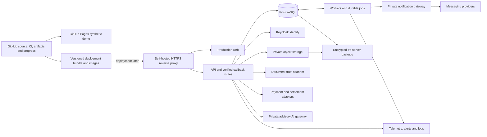

# Copy-and-paste implementation instructions

You are the engineering delivery lead for PRENEURA Real Estate OS. I authorize you to continue the existing repository into the complete production platform and deployment-ready package described in the completion plan appended below. This is an execution assignment: inspect, implement, test, document and persist progress. Do not stop at proposing another plan or completing a small convenient subset.

Repository: https://github.com/karimelzoser/realestate
Published synthetic demo: https://karimelzoser.github.io/realestate/

Planning documents are on branch `plan/egypt-platform-completion`, under `docs/production-completion/`. Read that branch if the completion integration branch has not yet been created. The planning branch inherits the reviewed production candidate and contains documentation/control files only. On the first execution, use its verified current HEAD as the base for `completion/egypt-full-platform` so the code baseline and plan travel together.

## Settled user decisions — do not ask these again

- First release is for Egypt, serving developers and brokerages, with a complete buyer experience.
- At EOI the buyer selects an apartment type. At allocation the buyer selects an exact available apartment from the eligible type. Preserve this distinction in UI, API, database, pricing and contract evidence.
- Arabic and English UI are required. English voice is required initially; Arabic voice is later scope.
- All source, plans, progress, tests, service definitions and deployment tooling belong in GitHub.
- Keep a shareable GitHub Pages demonstration using synthetic data. Do not use Pages as a backend, live financial/identity application or commercial SaaS host.
- Do not use Railway or require a Railway MCP connector.
- We have a self-hosted server. Prepare the entire platform and deployment package first. Server deployment is a later separately authorized stage; do not connect to, modify or deploy to the server now.
- Prepare Docker Compose/images, GitHub CI/artifacts and ordinary SSH/CLI deployment scripts so later installation does not depend on a hosting MCP. Never claim this removes real hosting capacity/cost limits.
- When I say **continue**, use the persisted plan/state and resume without asking me to repeat settled details or give permission for routine authorized source/test/documentation work.

## Authority and scope

Reuse the existing production implementation and its invariants. The appended completion plan defines the desired final product. Older repository statements saying buyers never select exact apartments are superseded by my decision above. Preserve historical data and schema compatibility while implementing the new path.

I authorize focused source changes, tests, documentation, configuration and migration files; branch creation; commits/pushes to work branches; draft PRs; disposable local/CI test environments; builds and reviewable deployment/demo artifacts. Respect actual tool/repository access and platform approval requirements. Do not blindly merge the 47 historical PRs, force-push/reset user work, expose secrets, publish real customer data, run destructive/production migrations, purchase resources or deploy the production server. Do not treat a plan or 'continue' as authorization for those excluded actions.

Keep the existing Pages demo recoverable. Prepare updates/preview artifacts and publish synthetic demo changes only through the authorized repository publishing workflow/policy after checks. Do not replace the published demo with a broken login shell or production page requiring missing backend credentials.

Make routine implementation choices yourself and record the reason. Ask only for an indispensable unresolved business decision or required authorization, after completing independent work. Missing provider credentials or deferred server access are external/deferred deployment dependencies, not a reason to abandon unrelated software work. A genuine policy/tool restriction cannot be overridden by this prompt.

## Initial inspection and known baseline

Read current repository heads, AGENTS.md/instructions where present, root README, the production plan/domain/delivery documents, candidate/service/runbook docs, workflows and relevant code. Inspect actual branch dependencies and changes. The reference integrated candidate is PR #81, branch `feature/production-full-stack-acceptance`, SHA `c2746523eb434898cbb4c46cf5df452d122ba78f`; main/demo was `1a6e61c891e040221f09c773e6de589928a9a0b7`. Revalidate them; they may advance.

Do not start production development from demo-only main and recreate existing domains. Find the authoritative integrated candidate. Existing production code has Next.js/NestJS/Fastify/PostgreSQL, four processes, 41 migrations and 11 scoped roles. Reuse identity/access/catalog/pricing/finance/documents/worker/broker/admin work. Preserve the immutable financial and contract evidence, unique locks, allocator guards, frozen quotes, outbox and checksummed migration history. Append reviewed migrations; never edit applied migration content as a shortcut.

Known audit findings to verify and fix before release:

1. Tenant suspension affects the workspace selector but the central assignment/scope checks do not consistently enforce tenant lifecycle for direct API requests.
2. Open SSE project/broker/notification streams retain initial authorization and lack timely revocation/session/support-expiry enforcement.
3. Privileged MFA/fresh step-up is not enforced across all login paths; phone OTP cannot be a bypass for staff/admin/finance/support authority.
4. Final Gate 7 readiness assertion expects `status=ok`, but the API returns `status=ready`.
5. The deployment manifest pins the older PR #77 runtime `288f4afba3b87dbc123eff6b198e1720075edc7d`; newer acceptance code includes a runtime logout-status fix. One final tested/artifact runtime must replace stale pins.
6. Standard package `pnpm test` discovered zero tests and Next web `lint` calls unsupported `next lint`. Custom SQL/scripts/CI tests exist; connect them to truthful normal commands.
7. Full-stack acceptance uses seeded sessions and test-mode API/worker/gateway; extend evidence to real production-config multi-process login and complete browser journeys in isolated test environments.
8. Demo recommendation filtering treats BOOKED/HOLD/unknown state incorrectly, hardcodes EGP against euro fixtures, and soft-scores some hard eligibility. Make status/eligibility/currency authoritative.
9. Demo property/finance fixtures show conflicting scopes/totals; use one coherent Egyptian synthetic dataset.
10. Transaction lists are capped without a complete paging path; some KPIs are derived from limited rows; replay/refetch and stale request races need correction.
11. WhatsApp sends have an accepted-but-not-recorded crash/timeout window; database idempotency alone does not establish exactly-once external delivery.
12. Production UI lacks the complete public buyer/visual/voice journey, exact-selected-unit path, grace workflow, full contract generation and after-sale support/updates shown in the demo.
13. Documentation contradicts runtime on type-only selling, Temporal and request-ID behavior. Reconcile it through current accepted decisions/ADRs.

Prior audit evidence included passed frozen install, strict typechecks and all four builds. Do not present that as current evidence for your changed SHA. Latest Gate 7 was a successful preflight with live certification skipped, not a production GO.

## Persist the plan before coding

Create/reuse the stable integration branch `completion/egypt-full-platform` from the verified planning branch (which inherits the integrated candidate). If a replacement already exists, record it and use it; do not create competing canonical branches. Use focused task branches/PRs against that branch. Follow applicable review/merge policy and do not label unmerged work integrated.

Immediately verify/update the existing appended completion plan in `docs/production-completion/PLAN.md` and the planning-stage control files below. Create missing files, preserve verified history and expand the initial ledger into implementation tasks:

- `DECISIONS.md`
- `TASKS.md` and `TASKS.json`
- `PROGRESS.md`
- `WORK_STATE.json`
- `SERVICE_READINESS.md`
- `BLOCKERS.md`
- `CONTINUE.md`

Commit/push these control files to the known integration branch before undertaking long changes. If remote writes are unavailable, preserve local artifacts/patches and say exactly what was not persisted. Do not claim interruption-safe GitHub persistence for unpushed files.

Convert every epic E00–E17 into tasks with stable IDs, dependencies, priority, actor/scope, deliverables, acceptance criteria and required tests/evidence. Preserve all agreed demo functions in a parity matrix. Track NOT_STARTED, IN_PROGRESS, IMPLEMENTED, TESTED, REVIEWED, INTEGRATED, EXTERNALLY_BLOCKED and DEPLOYMENT_DEFERRED separately. Add SOFTWARE_READY_FOR_DEPLOYMENT only to the true final software outcome. LIVE_PRODUCTION_GO is a later outcome.

A minimal state record:

```json
{
  "schemaVersion": 1,
  "repository": "karimelzoser/realestate",
  "integrationBranch": "completion/egypt-full-platform",
  "taskBranch": null,
  "observedHeadBeforeCheckpoint": null,
  "activeTaskId": "E00.1",
  "activeTaskStatus": "IN_PROGRESS",
  "completedCheckpoint": null,
  "nextAction": "Verify current integrated candidate and preserve demo baseline",
  "changedFiles": [],
  "commandsAndResults": [],
  "evidencePaths": [],
  "remainingTests": [],
  "externalBlockerIds": [],
  "deploymentAuthorized": false,
  "acceptedDecisions": {
    "market": "Egypt: developers and brokerages",
    "eoiSelection": "apartment type",
    "allocationSelection": "exact eligible available apartment",
    "uiLanguages": ["ar", "en"],
    "initialVoiceLanguages": ["en"],
    "demoHosting": "GitHub Pages, synthetic only",
    "laterProductionHosting": "existing self-hosted server, Docker, CLI/SSH",
    "railwayRequired": false
  }
}
```

The checkpoint cannot contain its own future commit SHA; record the observed/implementation SHA and verify the actual checkpoint commit when resuming. Include commands still running, last output and how to inspect them, without secrets or unnecessary user information.

## Mandatory behavior on “continue”

1. Read the persisted control files from the known integration branch; do not depend on chat memory or default main. Inspect current HEAD, task branch, dirty files, remote/PR state and recorded running commands.
2. Reconcile state with actual code/test results. If code was committed but the ledger update failed, verify then repair the ledger. If a command was interrupted, inspect whether it completed before rerunning it. Never blindly rerun production migrations or discard uncommitted work.
3. Resume the current unfinished task. If it is genuinely external/deferred, choose the highest-priority dependency-ready unblocked task. Do not ask “what should I continue?” or repeat settled product questions.
4. Implement and validate a meaningful increment. Diagnose/fix failures; preserve working code and update relevant tests/runbooks. Commit/push code plus checkpoint and prepare reviewable PRs.
5. Update WORK_STATE/TASKS/PROGRESS with the exact next executable action and evidence. Continue useful authorized work rather than ending after a proposal or saying “shall I proceed?”
6. If tools, context or time force a stop, save the smallest truthful recoverable checkpoint. Connection failures cannot be guaranteed away; avoid large uncommitted batches.
7. When all remaining tasks are external or deployment is intentionally deferred, report the precise achieved state and remaining named dependencies. Do not invent credentials, live evidence, external approvals or a successful production launch; do not loop forever on the same blocked action.

Checkpoint after each meaningful schema/API/UI/test increment, before long commands and before ending a turn. Keep branch/location discoverable in CONTINUE.md and the PR description so another session can find it.

## Required working style and acceptance

Use existing stack/pinned lockfile and modular boundaries. Keep PostgreSQL as business authority. Client state may remember preferences but never decide stock, queue, money, contract or commission truth. Keep the synthetic Pages adapter distinct from the production API adapter; backend/provider failure cannot activate a fake success fallback.

For each feature implement its authorized UI, API contract/service, transactional persistence, state transitions, idempotency, audit/outbox, notification effect and telemetry. Add appropriate positive/negative/concurrency/recovery tests, not only file-existence or source-marker checks. Test actual routes and complete user journeys with real PostgreSQL and controlled identity/storage/scanner/provider sandbox services. A mock proves a contract, not a live provider connection.

Use explicit exact physical-unit IDs at allocation and frozen exact quote/contract snapshots. EOI type selection alone must not consume exact inventory. Preserve fair online/offline queue and assigned allocator/session rules. Grace requests do not extend inventory automatically; pending requests survive expiry as records, but approval can reclaim the same expired unit only atomically if still available. Never steal another buyer's lock.

Do not fake biometric verification, signatures, scanned-clean verdicts, payment confirmations or settlements. Define the genuine evidence/accepted manual or provider process. Keep National ID/phone/documents and provider secrets out of AI prompts and logs. AI guides/recommends/navigates; deterministic permission-checked commands and explicit user actions govern irreversible decisions.

Complete Arabic/English/RTL UI and accepted document/template language, with English voice and a truthful text fallback. Complete support/updates/receipts, brokerage multi-developer access boundaries, manager live seats/queue/grace/audit and production-scale pagination/aggregates. Maintain demo previews and prepared scenarios as training/demo features rather than production record mutation controls.

For service integration, build actual adapter code and configuration/contract tests, document selected providers and sandbox/live readiness. Missing live keys should block only the relevant verification/deployment step. If an approved adapter/provider choice is genuinely absent, register that exact unresolved dependency; do not silently swap it for a generic placeholder and declare the integration finished.

Prepare reproducible images/archives, non-root Compose runtime, private networks, proxy/TLS/SSE configuration, secret ownership/validation, serialized migration job, build-identity checks, smoke/backup/restore/rollback tooling, dashboards/alerts, SBOM/security checks and a server operator guide. Ordinary CLI/SSH deployment must work without a provider MCP. Do not install or deploy on our server during this stage.

Keep high-risk security/finance/locking/signature changes independently reviewable. Use one exact final software artifact set and record evidence from that set. No false “all production gates passed” claim based on skipped live jobs or attestations alone.

Report briefly at meaningful checkpoints: completed task IDs, changed behavior, tests/evidence, commit/PR and next action. Ask only indispensable questions, grouped with reasons and unaffected work already completed. Do not pad progress with repeated plans or claim finished when necessary software work remains.

## Start now

Inspect the actual repository and candidate, persist this assignment plus the appended full plan and task ledger, then begin E00/E01. Continue through all dependency-ready epics. Produce SOFTWARE_READY_FOR_DEPLOYMENT and an honest external/deferred deployment register when supported by evidence. After interruptions, my instruction **continue** means execute the resume protocol above.

The full completion plan follows. Copy it into PLAN.md, keep its accepted decisions authoritative, and update it only with recorded decisions/evidence rather than dropping difficult requirements.


===== FULL AUTHORITATIVE COMPLETION PLAN =====

# PRENEURA — full production completion plan

Prepared 11 October 2026 for https://github.com/karimelzoser/realestate.

## 1. Accepted product and delivery decisions

These decisions come from the user and supersede conflicting older repository design statements:

1. First market: Egypt. Customers: developers and brokerages; buyers are a first-class user audience.
2. At EOI, the buyer chooses an **apartment type**. EOI does not reserve a particular apartment.
3. At allocation, the buyer chooses an **exact available physical apartment** within the eligible type and project rules. The server must lock that selected apartment, never silently substitute another slot.
4. Arabic and English user interfaces are launch scope. English voice is launch scope; Arabic voice is later scope.
5. All application/service source, migrations, infrastructure definitions, plans and operational scripts belong in GitHub.
6. Keep a working, synthetic demonstration on GitHub Pages with a shareable link. GitHub Pages is not the live commercial platform or backend runtime.
7. No Railway dependency or Railway MCP deployment workflow. The user has a self-hosted server, but server deployment happens **after** software and deployment preparation are complete.
8. Prepare Docker-based self-hosted deployment and standard CLI/SSH/GitHub Actions tooling. Do not touch the server, alter DNS, deploy services, run production migrations or install credentials during the software-completion stage.
9. Progress must survive interruptions. Once this plan/prompt is ingested into the repository, the user must be able to say **continue** to resume the unfinished task without repeating settled decisions.

There are two separate completion outcomes:

- **SOFTWARE_READY_FOR_DEPLOYMENT:** implemented scope, tested integrations/contracts, reviewed migrations, built artifacts and complete operational/deployment package.
- **LIVE_PRODUCTION_GO:** subsequently deployed exact artifacts on the user's server, verified live providers, capacity/recovery/security/operations evidence, and an approved release decision.

Do not confuse either with a green static demo or structural CI check. A prompt cannot prevent network outages or remove required credentials; it can preserve work and avoid unnecessary clarification.

## 2. Current implementation baseline

Re-inspect current GitHub state before editing; these are reference facts, not assumptions that branches never move:

- Published main/demo SHA: `1a6e61c891e040221f09c773e6de589928a9a0b7` (6.7.1).
- Latest reviewed integrated code: `feature/production-full-stack-acceptance`, PR #81, SHA `c2746523eb434898cbb4c46cf5df452d122ba78f`.
- Existing Gate 7 runtime pin: `288f4afba3b87dbc123eff6b198e1720075edc7d` from PR #77; this differs from the latest acceptance runtime, including a logout-status fix.
- 41 migrations, four application processes and eight application/shared packages.
- At review: 47 open PRs, 46 draft; 80 branches. Do not merge all branches or treat every PR as a new independent requirement.
- Existing code includes identity, scoped roles, catalog/imports, pricing, inventory, EOI/queue/reservation, documents, finance/settlement, brokerage commissions, reminders, management/admin and buyer finance/property views.
- Frozen installation, typechecks and all four production builds passed locally. Standard package tests discovered zero tests; web lint failed. Custom SQL/certification scripts exist and must be preserved and integrated into normal commands.
- Latest Gate 7 run skipped final live certification. Live providers and target deployment were not verified by the audit.

Repository references to read: root README; `docs/PRODUCTION_MASTER_PLAN.md`, `PRODUCTION_DOMAIN_MODEL.md`, `PRODUCTION_DELIVERY_GATES.md`; `platform/docs/PRODUCTION_CANDIDATE.md`, runtime/deployment/configuration, finance, documents, pricing, concurrency and Gate 7 documents; `.github/workflows`; relevant `platform/apps`, `packages`, scripts and tests. Inspect AGENTS.md/skills if present in the execution environment.

Reuse working domains. Keep the published legacy demo recoverable. Reconcile documentation through architecture decisions; do not rewrite existing applied migrations or replace the existing ledger/authorization with prototype state.

## 3. Target architecture and runtime services

Keep the TypeScript modular monolith, Next.js web, PostgreSQL authority and dedicated worker. Keep the committed dependency graph; upgrade only for a justified incompatibility/security fix with new evidence. Begin with production Docker Compose for the existing server; do not introduce Kubernetes or microservices without a demonstrated need.



| Service | Required behavior | Delivery requirement |
|---|---|---|
| Production web | Buyer/public catalog, staff/broker/admin workspaces, Arabic/English, authenticated API access | Reproducible non-root container; real server routes work; runtime/build API origin documented |
| API | Server authorization, validation, commands/queries, session/assurance, signed provider callbacks, SSE | Non-root image; liveness/readiness/build identity; bounded body/rate limits; graceful shutdown |
| Worker | Outbox, expiry/grace reconciliation, reminders, notifications, scheduled policy work, recovery | Separate process; durable DB state; leases/idempotency/backoff; readiness and lag telemetry |
| Notification gateway | Verified-contact resolution, WhatsApp/SMS/email adapters and delivery status | Private authenticated service; signed provider callback boundary; uncertainty/reconciliation handling |
| PostgreSQL 18 | Transactional state, tenant/project constraints, ledger, locks/jobs and migration history | Separate migration/runtime roles; persistent storage; connection budget; backup/PITR and restore tooling |
| Keycloak | OIDC/Google identity and privileged MFA/step-up | Supported pinned image/config; realm/client export without secrets; protected administration; separate DB/schema and backup |
| S3-compatible storage | Quarantine, trusted documents, executed contracts, approved assets and backups | Private buckets; scoped policies; versioning/retention; restricted CORS; restoreable object versions |
| Document scanner | Recompute hash on actual stored bytes, MIME/size checks and malware verdict | Authenticated private HTTP adapter compatible with existing trust service; clamd/updates or accepted managed scanner |
| Contract rendering | Template-driven Arabic/English PDF generation and immutable rendered evidence | Durable render jobs; isolated renderer; font/template assets; HTML/input escaping; external fetch restrictions |
| Payment adapter | Approved Egyptian hosted checkout/provider callbacks and reconciliation | Provider credentials server-side; verified raw callbacks; normalized immutable ledger events; sandbox/live config |
| Settlement adapter | Refund/commission disbursements, verified confirmations/reversals and reconciliation | Explicit manual-bank evidence or approved provider adapter; never manufacture PAID from a browser flag |
| AI/voice gateway | English ASR/TTS/chat and safe UI action suggestions | Server/private credentials; authenticated short-lived transport; concurrency/quota/timeouts; deterministic/text fallback |
| Reverse proxy/TLS | Public web/API/auth endpoints and only necessary callbacks | Nginx/Caddy/HAProxy configuration, trusted headers, SSE timeouts, rate/body controls, certificate renewal |
| Telemetry stack | Correlated traces/logs/metrics, business invariants, host/storage monitoring | OTel collector and chosen metrics/log/dashboard/alert tooling; retention/redaction; owner and delivery tests |
| Backup/recovery | Application DB, identity DB, object versions and configuration | Encrypted off-server backups; least-privilege credentials; PITR where required; tested coordinated restore |
| Migration/release job | Checksum-protected, serialized schema changes | One-shot image/script; no app auto-migration; rehearsal/expand-contract compatibility |
| Redis, if justified | Distributed rate limiting/short-lived cache, never business truth | Document actual consumers; private networking/ACL; memory bounds; loss tests. Remove unused deployment dependency if not needed |

Scanner/renderer/payment/AI adapters can be modules or supervised processes; deploy separately only where isolation, language/runtime or capacity warrants it. PostgreSQL-backed reconciliation is acceptable if its semantics are tested. Resolve the old Temporal promise with an ADR; adding Temporal is not a requirement merely because an old document names it.

## 4. Hosting, demonstration and deployment boundaries

GitHub Pages serves static files. GitHub also restricts use for commercial SaaS/commercial transactions. Preserve the Pages site as a synthetic demonstration only: no real identity documents, financial uploads, passwords, OTP delivery, payments or private provider keys. A local/private voice demonstration must be clearly labeled and opt-in.

Required GitHub Pages outcome: the existing link remains usable; publish a modern demo preview at a separate path if necessary, and replace the root only after parity/visual/regression acceptance. Test repository base paths, deep links, refresh, assets and mobile layouts. Build a static demo bundle that reuses production UI/contracts through an explicitly injected demo data adapter. Fixtures may use IndexedDB/browser state, but may not pretend to prove cross-device server locking. Keep simulation and real API clients separate at build/configuration level.

Production web and backend run later on the existing self-hosted server, behind a real HTTPS domain. Prefer web/API paths on one origin, or same-site subdomains with tested cookie/CORS behavior. Do not make the commercial app depend on cross-site cookies from `github.io`; do not move sessions into browser localStorage as a shortcut.

Prepare GitHub Actions builds and GHCR/versioned archives. Prepare `deploy.sh`, `preflight.sh`, `migrate.sh`, `smoke.sh`, `rollback.sh`, `backup.sh`, `restore-rehearsal.sh` and a validated Compose deployment bundle. Remote deployment uses ordinary SSH/CLI, not a hosting MCP. No server connection is needed during this stage. Workflows must not automatically deploy production merely because a feature branch was pushed.

The later deployment workflow must use immutable image digests, protected environments, a pinned SSH host key, a restricted deploy account and serialized releases. Do not run arbitrary pull-request code on the production server or expose Docker control to untrusted CI jobs. Provide a manual CLI path if CI/registry quota is exhausted. MCP limits, CI quotas and server capacity are separate concerns; no claim of unlimited hosting is made.

## 5. Canonical business invariants

- One verified global account can have separate developer/project memberships; customer records and attribution remain scoped. Never merge identities/tenant data solely because names match.
- EOI chooses a type and snapshots its accepted policy. Eligibility is enforced server-side. Type changes after payment require an explicit audited policy; do not mutate a paid EOI silently.
- Online and Sales Center share one priority truth. Service channel affects compatible capacity, not privileged queue position. Define stable ordering and permitted compatible-channel dispatch explicitly.
- An exact apartment has one authoritative mapped physical unit/slot, one active lock and at most one active reservation/committed sale lifecycle. Unknown/held/booked states are not AVAILABLE.
- A buyer/allocator must own an eligible active allocation session/turn before acquiring the selected exact unit. Do not grant unrestricted project-wide `unit.lock` to every buyer.
- Quotes include exact apartment identity, applicable version, component/premium values, currency, areas and expiry. Preserve immutable historical prices/evidence; never silently change prices after acceptance.
- Monetary values for the first release are EGP with explicit decimal arithmetic and rounding; schedule totals must reconcile exactly. Future currencies need validated precision policy, not a free-form selector.
- Money/payment truth comes from verified provider/bank evidence and ledger entries, not redirect URLs, AI or UI status toggles. Replays do not double-post.
- Contracts bind the verified buyer, exact apartment, price, payment plan, template/language/version and required signatures. Revisions/amendments create new evidence; never replace executed objects.
- Brokerage attribution and commission terms are frozen at their business commitment point. An agent sees their own authorized cases and status, not confidential economics by default.
- Grace, exceptions, waivers, refunds and payouts have named authority, reason, state transition and audit evidence. AI cannot approve them.
- Tenant suspension/role revocation/session expiry applies to direct requests, subscriptions and support access, not merely navigation visibility.
- Production data never falls back to synthetic fixtures when a backend/provider fails. Show accurate failure, pending and retry states.

## 6. Execution backlog and dependencies

Each epic must be decomposed into tasks with actor, scope, preconditions, command, success/failure transitions, permission, idempotency/audit/notification behavior, telemetry, migration/API/UI changes and evidence. Proposed filenames are targets; inspect existing names before creating duplicates.

### E00 — Repository authority and interruption-safe execution

Create a stable branch `completion/egypt-full-platform` from the verified current integrated candidate; use focused task branches/PRs against that integration line. Preserve the Pages baseline and identify superseded/integration-only PRs without indiscriminate merging. Reconcile the existing master plan/domain model/delivery gates with the accepted type-at-EOI/exact-at-allocation journey.

Commit these control files on the stable integration branch before implementation:

- `docs/production-completion/PLAN.md` — this plan and approved changes.
- `DECISIONS.md` — user decisions, ADR links, assumptions and scope boundaries.
- `TASKS.md` and `TASKS.json` — dependency-aware task ledger.
- `PROGRESS.md` — completed work, evidence and current checkpoint.
- `WORK_STATE.json` — active task/branch/SHA/next action/recovery state.
- `SERVICE_READINESS.md` — code/config/test/live-evidence state for each service/provider.
- `BLOCKERS.md` — external dependencies with owners and affected tasks.
- `CONTINUE.md` — exact resume protocol and checklist.

Acceptance: a new execution session can read these files, locate the same code and resume without re-asking market, selling model, voice or hosting decisions. Checkpoints refer to committed code/evidence, not optimistic summaries.

### E01 — Repair the known security/release/testing defects

Enforce tenant/membership/project lifecycle policy centrally; define suspended historical-read versus write behavior. Invalidate/revalidate open project/broker/personal streams on session/role/support expiry and suspension. Enforce privileged assurance and fresh step-up for support/finance/high-risk administration across OTP and OIDC routes. Record assurance type/time in sessions and check it server-side; phone OTP is not privileged MFA by default.

Repair final readiness assertions (`ready` is readiness; `ok` is liveness) with actual JSON parsing. Verify deployed build identities instead of trusting an operator-entered SHA. Consolidate final runtime/manifest/evidence pins. Repair web lint and make normal unit/integration/E2E commands execute meaningful tests; zero discovered mandatory tests must fail, not falsely pass.

Add rate-limit/abuse controls, origin/CSRF policy for cookie writes, sensitive redaction, trusted-proxy configuration and secure account recovery. Review all direct/provider/stream/file routes for scope and sensitive-field projection, including mixed-role users.

Acceptance: negative direct API tests after tenant/user/role revocation; live-stream expiry/revocation tests; no privileged bypass through phone login; unauthorized/malicious callback and file access rejected; real test/lint commands pass; known gate defect reproduced then fixed.

### E02 — Egypt profile, identity and bilingual foundations

Provide Arabic/English translation resources, RTL/LTR layout, labels/errors/statuses/emails/reminders and document language. Support keyboard navigation and screen readers; test mixed Arabic names, Latin IDs and EGP values. Store instants in UTC and use Africa/Cairo timezone rules for display/business schedules; avoid fixed-offset calculations and test DST boundaries.

Default phone parsing to Egypt but accept valid international E.164 contacts where allowed. Define National ID/passport normalization, issuing-country/type namespace, verification status and consent; phone ownership alone does not prove a National ID belongs to a person. Implement approved manual verification or a genuine provider integration. Minimize PII access and preserve audit without exposing raw identifiers.

Acceptance: equivalent Arabic/English critical journeys; accurate EGP values; no unqualified identity-verification claims; authorized enrollment/recovery and cross-tenant duplicate/linking scenarios.

### E03 — Developer/brokerage organization and onboarding

Complete developer/client provisioning, branding, project creation, staff/broker invitation, project agreements/access windows and deactivation. A brokerage can access projects from multiple developers only through explicit scoped agreements. Model shared brokerage identity separately from tenant-owned contracts/records if a unified cross-developer portal requires it; do not broaden tenant data access.

Complete Broker Manager/Finance/Agent account management, lead/buyer assignment, attribution disputes and audited transfers. Attribution must not be overwritten for historical transactions when an agent changes company or a buyer enters another project. Establish platform plan/entitlement and usage records with auditable B2B billing/invoice administration; automatic recurring billing is not needed to replace a legitimate approved manual B2B invoice workflow.

Acceptance: one developer/project plus two brokerages works, and the same brokerage sees only approved projects across two developer tenants. Agents cannot grant themselves financial/administrative privileges or steal another agent's attribution.

### E04 — Catalog, physical inventory, assets, imports and pricing

Complete published public project/residential/commercial/unit-type views, areas/specifications, photos, amenities, favourites and preferences. Staff-only unpublished inventory stays private. Add exact-apartment public/display references and verified physical-unit → slot mapping. Exact selection requires that mapping; do not publish anonymous unmapped inventory for the new exact-selection journey.

Complete physical attributes and versioned per-unit price adjustments where floor/view/area/premium values differ from a type price. Implement deterministic quote APIs with exact identity and component breakdown, validity and published policy version. Imports must create/validate mappings and give preview/errors/rollback; never overwrite an executed transaction's history.

Approve asset provenance and publish sanitized, scanned/correct-MIME assets. Cover master-plan polygons, buildings/floors, 2D plans, images and GLB/3D metadata. Large 3D assets load on demand with device/accessibility fallback; reference illustrations must not be represented as surveyed exact views.

Acceptance: inventory counts reconcile by type/building/floor; price fixtures reconcile to exact selected units; imports cannot introduce duplicate references, orphan mapping, invalid scope or silent price mutation.

### E05 — Public buyer acquisition, EOI type selection and eligibility

Complete browse-before-login, create/link account, verified login, preferences/favourites and direct/broker/staff entry. Add the chosen apartment type to EOI state/contracts/UI; verify the type belongs to the project and accepted sales window. Keep type-at-EOI independent from physical-unit selection and capacity commitment.

Complete EOI amount/policy acceptance, hosted payment/manual approved payment evidence, eligibility requirements, document checklist, invitation and attendance choice. Preserve one scoped buyer record across channels. Before public allocation, require paid/valid EOI, accepted identity/document requirements and eligible type; demonstrate missing-step completion and rejection paths.

Acceptance: direct, broker and staff buyers complete the same backend path. Refresh/logout/relogin preserves progress. EOI cannot lock an exact unit, invent eligibility or change another buyer's attribution.

### E06 — Shared queue, online slots and human allocation

Implement allocation event windows, invitation/check-in/token, wait/turn visibility and receptionist flow. Model compatible online/human capacity and durable allocation sessions. Stable shared ordering remains consistent under concurrent check-in/dispatch and channel changes. Human allocators claim the next eligible called buyer; no arbitrary buyer picking. Online buyers receive a scoped active turn/session rather than a blanket unit-lock capability.

Define no-show, cancellation, abandonment, rejoin, service timeout and operator override policies with explicit permission/reason. Manager sees queue/seat capacity/waits and actual events across both channels. Do not use browser timers as authority.

Acceptance: concurrency tests preserve ordering, one active session per service slot/allocator, no unauthorized turn/priority changes and safe reconnect/worker restart behavior.

### E07 — Exact apartment selection and atomic locking

Implement Master Plan → Building → Floor → Exact Apartment using approved assets and authorized current availability. A buyer can compare eligible physical units, view exact price/specifications, and explicitly confirm the chosen physical ID.

Add exact-unit command/contract/repository paths with one-to-one mapping, active session/turn and EOI type eligibility, idempotency and quote validation. Preserve unique active slot-lock/database guards. Existing type-capacity APIs must not bypass exact-selection rules or expose hidden inventory to buyers. Carry exact identity through reservation, transaction, contract and My Property snapshots.

Acceptance: hundreds of simultaneous attempts for one selected apartment produce one winner, no substitution and stable conflict responses. Retries return the same successful lock; double-click, stale tabs, cross-project IDs, withdrawn units, expired turns and ineligible types cannot acquire stock.

### E08 — Two-stage grace, operator inbox and durable recovery

Persist short handoff state, countdown authority, extension requests/reasons, decisions, offline paperwork exceptions, actor/timestamps and transition history. Default short grace is 15 minutes unless project policy changes it for new locks. Online extensions require a buyer request and Transaction Operator approval. Offline 24-hour exceptions require the operator's authorized reason. Approved extended grace begins at approval time; it does not start automatically.

Pending requests survive in the inbox after short expiry, but do not hold inventory indefinitely. If the lock expires, release safely. Approval after expiry must atomically reacquire the **same exact apartment only if still available**; otherwise return an explicit inventory-lost decision and offer an authorized new selection. Never take the apartment from another buyer. Race approval versus expiry versus conversion; one transition wins. Completed handoff closes grace; cancellation/release is audited and reconciles queue/session state.

Acceptance: Buyer, Allocator, Operator and Manager show the same server state/countdown. Requests remain visible while other transactions are open. Multi-worker sweeps, restart, clock boundaries and concurrent decisions produce one inventory outcome and consistent events.

### E09 — Payments, installments, cheques, refunds and reconciliation

Complete payment-intent/hosted-checkout flow, manual bank/receipt review where permitted, raw signed callback adapter, replay protection and provider-to-tenant/merchant/order/amount/currency binding. Browser success screens cannot post payment evidence. Support pending, partial, failed, repeated, out-of-order, refund and reversal outcomes without double-posting.

Bind a versioned payment plan and exact frozen price; schedule/fee/EOI application arithmetic reconciles in EGP. Keep the ledger/compensation invariants. Add reconciliation jobs/reports, unmatched-event queue and receipts generated from verified ledger state. Cheque evidence/history remains separate; enforce maker/checker for manual receipts, exceptions, refunds and payouts where the approved policy requires it.

Use a selected Egyptian payment provider's approved SDK/API and sandbox, not a generic fake PAID adapter. Paymob is a researched example, not an authorized merchant/provider commitment. Prepare its adapter only if selected, or use the developer's approved provider. Do not store card numbers/CVV. Bank transfer and settlement adapters require real accepted evidence and explicit finance authority.

Acceptance: callbacks fail for wrong signature/merchant/amount/project; replay/out-of-order/reversal scenarios reconcile exactly; payment-at-lock-expiry conflicts have a documented compensating outcome, never double sale/lost money; finance reports/receipts match the ledger.

### E10 — Documents, exact contract generation, signing and execution

Complete template administration and required-document policy, upload intent/quarantine/scanning/review, private authorized view/download and audit. Pin object versions/content hashes; do not trust user-supplied metadata as proof of the bytes. Every newly public/project asset and business document has an appropriate content/trust policy.

Implement durable populated PDF generation binding buyer/project/building/floor/apartment/price/payment plan/EOI/broker context to the accepted template version and Arabic/English fonts. Block missing required values/invalid policy/template and use isolated rendering. Provide preview, print, returned signed-copy upload, company signature/stamp and immutable final manifest/object version.

Signature challenges bind the exact document hash, actor, transaction and expiration; they are single use. Record genuine typed/drawn/provider evidence under accepted policy. Biometric/fingerprint walkthrough must be backed by an approved real provider/device/manual verified process with truthful labeling and domain-owner acceptance. Do not fabricate biometric receipts or claim a browser device unlock verifies legal buyer identity. If genuine biometric proof is a mandatory policy and no integration is available, record that release dependency instead of a simulated pass.

Acceptance: modified template/quote/object requires a new document/challenge; revoked/unauthorized signers cannot sign; replay/reordering/missing signer/scanner outage/infected files fail closed; executed contracts cannot be overwritten; exact apartment appears consistently in generated, printed and stored evidence.

### E11 — Full after-sale buyer portal

Complete exact property details/galleries/specifications, purchase and handoff progress, paid/remaining/overdue/next-due summaries, full schedule, verified receipts, contract/document view/download, notices and project updates. Add support cases, comments, attachments, assignment/status, notification and ownership controls. Define support SLA and escalation; sensitive attachments use the same private scan/read boundary.

Acceptance: every displayed financial total reconciles to the same snapshot/ledger; no unrelated buyer/project documents or support cases leak; stale project requests cannot overwrite another selected project's display; updates are real published records rather than hardcoded announcements.

### E12 — Brokerage finance and developer control rooms

Finish multi-project brokerage pipeline, company/agent metrics, onboarding, attribution, commission prerequisites/countdown, invoices, disputes and payout evidence. Finish executive overview, Buyer 360, cross-role journey audit, exact inventory, capacity/seats/waits/locks/grace/exception controls, project imports/pricing/doc policies, collections and broker performance.

Provide server aggregates for KPIs and cursor pagination/filter/sort/export for lists; do not derive portfolio counts from the newest 200 rows. Use shared scoped query state/cancellation/generation checks and coalesced realtime refresh; sensible cursors prevent full-history refetch storms. Keep sensitive rates/amounts independently redacted in REST/SSE/CSV/UI.

Acceptance: role matrix tested through HTTP/browser and exports; one high-volume dataset proves correct counts and navigable older cases; mixed-role users only receive scoped union permissions, not blanket global finance access.

### E13 — Messaging, reminders and provider delivery lifecycle

Complete WhatsApp/SMS/email onboarding, approved English/Arabic template maps, encrypted verified contacts, consent/preferences and appropriate transactional opt-out rules. Provider callbacks verify signature before recording sent/delivered/read/failed evidence. Retain provider IDs without PII-heavy logs.

Internal job uniqueness does not prove exactly-once external sends. Handle accepted-but-response-lost outcomes and process crashes; use provider-supported idempotency/reconciliation, uncertain delivery states and bounded recovery. Avoid uncontrolled repeated OTP/reminders. Keep dead-letter/retry administration scoped and audited.

Acceptance: duplicate/stale claim and provider outage scenarios; no delivery to unverified contacts; correct currency/locale/timezone templates; wrong-signature callbacks rejected; approval/expiry/payment changes cancel obsolete reminders.

### E14 — English voice and safe advisory AI

Port the full English guidance experience into production: low-latency audio, microphone opt-in, ASR, streaming TTS, interrupt/barge-in, conversation status, compare/recommend, master-plan/floor/unit navigation, highlight and accessibility/text fallback. Arabic UI remains usable with explicitly labeled English voice; Arabic inference is not a launch requirement.

Use a protected server/private gateway. The existing local Qwen/Whisper/TTS path is an available starting point; confirm model availability, hardware, licenses and measured latency before pinning it. Provider inference is optional behind an adapter. AI cannot alter price, eligibility, turn, locks, payments, grace decisions or signatures without the real permitted deterministic command and explicit user action.

Use exact authorized unit candidates, hard eligibility/availability filters, project currency and minimized preferences. Fix BOOKED/HOLD/unknown-state and hardcoded-EGP/demo inconsistencies. Sanitize retrieved content, validate structured model actions against an allowlist, apply budgets/timeouts and keep raw identity/documents/payment data out of model prompts. Manager insight uses permitted aggregates and named metrics, not invented figures.

Acceptance: hard-filter/adversarial prompt tests, no forbidden action, stale availability fallback, outage/text flow, user-controlled audio, interruption behavior and acceptable latency on intended hardware. The assistant never hides the primary mobile buying action.

### E15 — Demo parity and end-to-end product acceptance

Maintain a feature-by-feature matrix linking demo screen/action → production command/API → role/scope → data/event → tests → evidence. Include all functions in the companion completion inventory. Production views use real API contracts; the demo adapter uses unmistakably synthetic fixtures.

Keep How It Works/direct previews, role examples, Normal Day/Queue Pressure/Unit Conflict/Overdue Collections/Broker Performance/Reset Demo for the demonstration and training scope. Reconcile one Egyptian synthetic project's EGP values, statuses and balances across all roles. Do not copy legacy global scripts wholesale into production.

Acceptance: static Pages build passes route/asset/deep-link tests; no secrets/PII/provider side effects; desktop/mobile Arabic/English flows verified. Full production browser tests cover complete direct online purchase, broker-attributed purchase, assisted offline purchase, grace request/decision, expiry/conflict/reselection, document/signing and My Property. Seed fixtures prepare initial data; they must not bypass the commands being tested.

### E16 — Production containers, observability and deployment package

Build all application/process images with pinned lockfile/toolchain and per-image source SHA/digest metadata; non-root runtime, minimal filesystem writes and graceful termination. Add production/staging/local Compose overlays, networks/health/restart/resource policies, persistent volumes, secret-file conventions and a one-shot migration service. Resolve unused infrastructure requirements and configuration contradictions; validate real `NODE_ENV=production` services together in a controlled environment.

Deliver reverse proxy/TLS/SSE settings, DNS/port matrix, credential ownership, clean host bootstrap, deployment preflight/migration/rollout/smoke/rollback scripts, upgrade instructions and offline/manual artifact installation. Backups cover business DB, identity DB, object versions and matching configuration; restore must verify hashes, scope, schema/ledger and actual file readability.

Ship dashboards and actionable alert rules, not just metric names: availability/errors/latency, lock conflicts/expiry, queue waits/capacity, outbox/job lag, provider failure, financial reconciliation, storage/disk/backup age, scanner failures, authentication abuse and AI cost/latency. Record real named owners later.

Acceptance now: fresh disposable environment runs the package with documented configuration and genuine services or clearly labeled provider sandbox substitutes; malformed config fails; no remote-server changes. Later deployment acceptance is a distinct gate.

### E17 — Performance, security, disaster recovery and release readiness

Run the complete matrix on one final source SHA/artifact set: lint/types/unit/real PostgreSQL integration/API/E2E/property-based money/concurrency/dependency/CodeQL/secrets/container/SBOM checks and provider contract tests. Review authorization/finance/locking/signatures independently. Container runtime privileges and private/public network boundaries are part of security acceptance.

Use realistic API/queue/lock/SSE/upload/scanner/worker load, not only database batches or health endpoints. Define expected peak buyers/staff/connections and test sustained peak plus a documented burst factor. Exercise worker/API/DB restarts, provider timeouts and ambiguous callbacks. Practice coordinated DB/object/identity restore and schema-compatible binary rollback in isolation.

Preserve existing proposed service targets (99.9% availability, ordinary API p95 <=500 ms, lock p95 <=750 ms, outbox lag <=60 s) as planning targets, not proven achievements. Record test topology and actual numbers. Proposed revocation bound is <=15 seconds for open streams, subject to accepted policy; presigned file URLs need separately bounded expiry/proxy invalidation. Agree and measure RPO/RTO with the owner; no invented production SLA or recovery guarantee.

Acceptance: all required software capabilities/tests/package evidence complete; no unresolved software P0/P1; external live dependencies separately enumerated. Publish SOFTWARE_READY_FOR_DEPLOYMENT only if that is true. Deploy later solely after explicit authorization and required server/provider configuration, then execute final LIVE_PRODUCTION_GO gate.

## 7. Data model and state-machine requirements

Reuse existing tables where semantics match. Append new migrations after the current final version, verifying actual head/ledger rather than assuming 0042 is always free. Likely additions include chosen EOI type and accepted-policy snapshot, physical attributes/exact quotes, allocation event/capacity/session, grace request/decision/history, contract render/signature challenge, provider event/delivery/reconciliation records, support/update records, notification preferences and session-assurance/revocation metadata.

EOI: DRAFT/type choice → payment pending → verified paid → eligible/invited → allocation → applied to reservation, with explicit rejected/cancelled/expired/refund paths. Preserve existing audited financial states; do not rename them blindly.

Allocation: waiting → called/active scoped session → selected exact unit/active lock → handed off → reservation/transaction; expired/released/no-show/rejoin paths are explicit. Preserve the queue/lock sync guards when adding new paths.

Grace: short active → request pending / approved extended / denied / completed / expired / released. Request status and inventory-lock status are separate, so a pending decision can survive without asserting a held apartment. Worker-safe optimistic version checks/row locks and unique decision effects prevent duplicate outcomes.

Payments: verified receipt → allocation → compensation/refund as immutable evidence. Provider message reception is not payment acceptance until authenticity/business binding checks pass. Pending/reconciliation exceptions remain visible.

Contracts: template/version + exact immutable business snapshot → render/quarantine/trust → review → required single-use signing challenges/signatures → stamp/execution snapshot. Amendment is a new version/lifecycle.

Specify invariants, allowed actor/state transitions, transactional boundary, idempotency key, outbox/audit event and compensating behavior before coding each state machine. Every public command validates tenant/project/buyer/unit/merchant relationships and lifecycle in the transaction where it matters; do not rely exclusively on preflight checks.

## 8. Provider/service preparation and later owner inputs

For each provider maintain: purpose, chosen adapter, docs/version, environment, code/config/tests, sandbox evidence, live evidence, secret names, callback/authentication rules, limits/timeouts/reconciliation, owner and blocker state. A placeholder URL or successful mock is not a live integration.

Required later inputs: server OS/architecture/capacity/disk/backups; domains and DNS authority; restricted deploy SSH account/host-key trust; registry read access; merchant accounts/approved payment flows; messaging accounts/phone/template approvals; Google/Keycloak client details; private object storage; scanner settings; accepted contract/identity/signature/biometric policy and providers; observability destinations/on-call owners; finance settlement/reconciliation arrangements.

Store values only in protected secret configuration. Repository examples document variable names and validation, never real credentials/OTP/private keys. Existing names include DATABASE_URL, WEB_ORIGIN, auth/contact HMAC/pepper/encryption keys, COOKIE_SIGNING_SECRET, OIDC_*, NOTIFICATION_GATEWAY_*, META_*/WHATSAPP_TEMPLATE_BINDINGS_JSON, OBJECT_STORAGE_*, DOCUMENT_SCANNER_*, FINANCE_PROVIDER_INGRESS_TOKEN, SETTLEMENT_PROVIDER_INGRESS_TOKEN and OTEL_*; inspect actual runtime requirements and add missing component-specific variables.

Do not require these inputs to start independent coding. Record externally blocked tasks and continue eligible code/tests/package tasks. Ask only when an indispensable new business decision or required authorization cannot be inferred; settled user decisions are never asked again.

## 9. Testing and evidence definition

Minimum matrix includes:

- Unit/property-based tests for price, EGP rounding, schedules, refund/commission calculations and state transitions.
- Real PostgreSQL tests for all append migrations, uniqueness/tenant constraints, lock expiry/concurrency, grace races, immutable finance/contracts and rollback compatibility.
- HTTP tests for every role, ownership, mixed role, cross-tenant/broker access, suspension/revocation/MFA/session/CSRF/rate limits and provider signatures.
- Browser E2E for each complete journey and exception, Arabic/English/RTL, keyboard accessibility, phone viewport, refresh/deep link and stale request/project-switch behavior.
- Provider sandbox/contract tests and documented external evidence state; accepted-but-response-lost payment/messaging failures.
- Production-mode multi-process package test with actual cookies/login/OTP flow and file bytes, not only inserted session tokens and HTML login render.
- Load and chaos tests with named topology/parameters; coordinated restore/rollback and object/identity recovery.
- Static demo regression and synthetic-only bundle checks; server secrets never present in JS/source maps/artifacts.

A task is done when reviewed code, schema/API/UI/events, appropriate positive/negative/concurrency tests, runbook and acceptance evidence are committed. Track IMPLEMENTED, TESTED, REVIEWED, INTEGRATED, SOFTWARE_READY and LIVE_VERIFIED separately. Tests passing on another SHA or domain file-presence checks do not establish complete feature parity.

## 10. Delivery phases, ownership and estimate discipline

| Phase | Epics | Exit |
|---|---|---|
| Baseline/control and defect closure | E00–E02 | Resume files work; security/testing gates repaired; accepted scope/identity/language rules recorded |
| Exact commercial and buyer core | E03–E08 | Type EOI → eligible shared queue → exact lock/grace/reservation works through APIs/UI |
| Money, contract and after-sale completion | E09–E12 | Real evidence paths, exact contract/signing, broker/developer control rooms and buyer portal complete |
| Communications, voice and demo parity | E13–E15 | Required provider adapters, English voice and Arabic/English product/demo parity accepted |
| Deployment preparation and certification | E16–E17 | Reproducible package, operational tooling and same-artifact software evidence; no server deployment yet |
| Later server deployment | Approved release tasks | Owner authorizes deployment, credentials configured, live tests/recovery/capacity prove LIVE_PRODUCTION_GO |

Some work overlaps, but dependencies are explicit: EOI/type/pricing precede queue/exact locking; exact identity/quote precede contract generation; ledger/provider evidence precedes trustworthy receipts/settlements; security and configuration precede public real-user access. Deployment preparation can progress alongside domain work.

Capabilities needed: product/domain owner, technical delivery lead, backend, frontend/UX, QA automation, DevOps/SRE, integration engineering and independent security/finance review. Small teams can combine roles, but irreversible/high-risk decisions need another competent reviewer. Do not estimate completion from code volume alone. Re-estimate after E00/E01, using task sizes and provider dependencies; an AI session count or guaranteed completion date is not a reliable project estimate.

## 11. Continue/recovery protocol

On every initial session and every message containing continue/resume:

1. Read PLAN, DECISIONS, TASKS, PROGRESS, WORK_STATE, BLOCKERS and SERVICE_READINESS from `completion/egypt-full-platform` (or its recorded replacement). Find the integration branch even if the default branch still holds the demo.
2. Inspect actual current branch/HEAD, dirty files, relevant remote heads/PRs and any recorded running command. Preserve user/uncommitted work. Do not reset, force-push, recreate completed modules or blindly rerun migrations.
3. Validate whether the active task already reached its checkpoint. If code landed but bookkeeping did not, verify evidence and repair state. If a command was interrupted, inspect its actual outcome before retrying.
4. Resume the same unfinished task, or choose the highest-priority unblocked dependency-ready task if the previous one genuinely needs external input.
5. Implement a reviewable increment, run meaningful checks, fix failures, commit code plus state and synchronize the checkpoint to GitHub. Prepare scoped PRs when appropriate; do not mark merged/integrated without actual evidence.
6. Record precise next action and blockers at every checkpoint. Continue authorized useful work instead of ending after a plan or asking 'shall I continue?'.
7. If every remaining task is externally blocked or server deployment is explicitly deferred, report the exact achieved state and missing/deferred evidence. Do not fake completion, loop endlessly on the same failure or reinterpret deferred deployment as permission to deploy.

WORK_STATE must include schema version, repo/integration/task branch, observed HEAD, active task ID/status, completed checkpoint, next executable action, relevant changed files, commands/results/evidence paths, tests still needed, external blocker IDs and accepted decisions digest. No secrets. A ledger task includes dependencies, acceptance criteria, status, implementation commit/PR, test/evidence links and owner.

Checkpoint after each schema/API/UI/test increment and before any likely long command or end of turn. A meaningful checkpoint must be in the known GitHub branch: unpushed local files are not interruption-safe if execution environments change. If pushing is unavailable, explicitly record that recovery limitation and retain a portable patch/summary; never claim remote persistence falsely.

## 12. First executable task sequence

1. E00.1 verify current heads and integration candidate, protect demo baseline, create/reuse stable completion branch.
2. E00.2 commit accepted decisions, full plan/task ledger/continue state, baseline feature/service matrix and issue/PR lineage.
3. E01.1 reproduce then correct lifecycle authorization across direct requests; add real negative integration tests.
4. E01.2 implement prompt stream/session/support revocation and privileged assurance.
5. E01.3 fix final readiness/build-identity contract and test/lint discovery; establish a truthful standard check matrix.
6. E02.1 establish Arabic/English resources/RTL and Egypt identity/EGP/timezone policy.
7. E04/E05 design and implement chosen-type EOI and exact physical-unit quote/mapping; acceptance tests precede the allocation migration.
8. E06–E08 complete actual buyer/reception/allocator/grace/manager workflow; retain audited financial/queue invariants.
9. Continue the remaining epics according to dependencies. Do not stop after these first fixes or call a narrow staff-assisted slice the completed advertised platform.

## 13. Final software handover checklist

All agreed demo features mapped; production/business tests and source SHA recorded; security defects closed; exact-apartment and EOI-type path complete; Arabic/English UI and English voice accepted; document/contract/payment/commission/support flows real and coherent; correct EGP datasets; no production mock fallback; full deployment archive/images/digests/Compose/config/bootstrap/migrate/smoke/backup/restore/rollback/monitoring docs; service/provider readiness table with external evidence clearly pending where unavailable; all software P0/P1 closed; current checkpoint and next deferred deployment action in GitHub.

The later server stage separately requires real secrets/domains/providers, host/network/TLS verification, actual deployed build identities, live business smoke/load/monitoring/restore/rollback and named operational ownership. GitHub Pages demo availability never substitutes for this evidence.

## 14. Primary technical sources

GitHub Pages is static, and its published usage restrictions exclude commercial SaaS/primarily commercial transactions: [hosting description](https://docs.github.com/en/pages/getting-started-with-github-pages/what-is-github-pages), [limits](https://docs.github.com/en/pages/getting-started-with-github-pages/github-pages-limits). Preserve the public demonstration accordingly.

Next.js static exports cannot provide request-time server features. A Pages demo needs a genuinely static build/adaptor; it cannot deploy the existing Next.js server unchanged: [static export guide](https://nextjs.org/docs/app/guides/static-exports).

Docker documents production Compose overlays/remote hosts; GitHub documents image builds/publication and provenance. These support the proposed provider-independent deployment package: [Docker production Compose](https://docs.docker.com/compose/how-tos/production/), [GitHub image publishing](https://docs.github.com/en/actions/tutorials/publish-packages/publish-docker-images).

Keycloak documents step-up authentication; enforce the required assurance in the application too: [administration guide](https://www.keycloak.org/docs/latest/server_admin/index.html#_step-up-flow). ClamAV's documented daemon/stream protocol can back the private scanner adapter: [clamd protocol](https://docs.clamav.net/manual/Usage/ClamdProtocol.html). S3 Object Lock provides retention mechanisms for supported storage providers; verify actual chosen-provider behavior rather than assume generic S3 compatibility implies retention: [Object Lock](https://docs.aws.amazon.com/AmazonS3/latest/userguide/object-lock.html).

For selected providers use their current primary docs and sandbox. Examples: [Paymob callbacks](https://developers.paymob.com/paymob-docs/developers/transaction-callbacks) and [Meta's official webhook/template examples](https://github.com/fbsamples/whatsapp-api-examples). No provider account, price, approval or live evidence is assumed by this plan.
